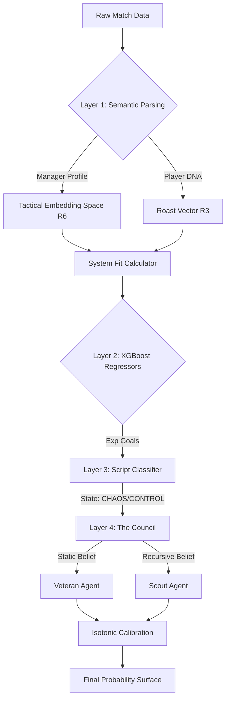

# Recursive Sports Reasoning Engine (RSRE-v1)

> **Research Prototype | SenatraxAI Research Lab**
> *A Hierarchical Bayesian System for Tacitcal High-Dimensional Sports Prediction.*

[](https://github.com/SenatraxAI/Recursive-Sports-Reasoning-Engine)
[](https://github.com/SenatraxAI/Recursive-Sports-Reasoning-Engine)
[](https://github.com/SenatraxAI/Recursive-Sports-Reasoning-Engine)

---

## 🏗️ System Architecture

The **Recursive Sports Reasoning Engine (RSRE)** diverges from traditional frequentist models by implementing a **Stateful, Hierarchical Architecture**. It attempts to solve the *Tactical Blindness Problem* inherent in Poisson-based goal models.



---

## 🔬 Methodology

### 1. Latent Tactical Embeddings (Manager-Player Fit)
Traditional models treat teams as static entities. RSRE treats them as dynamic aggregations of **Managerial Demands** and **Player Attributes**.
We project every manager into a 6-dimensional latent space ($V_M \in \mathbb{R}^6$) representing tactical constraints (e.g., *Verticality*, *Press Intensity*).
Players are similarly embedded ($V_P \in \mathbb{R}^3$).
The **System Fit Score** ($\phi$) is derived via a weighted Euclidean distance function:
$$ \phi(P, M) = \frac{1}{1 + e^{k \cdot || V_P - V_M ||}} $$
This allows the model to quantify "Tactical Friction" dynamically.

### 2. Recursive Bayesian State Estimation
The engine maintains a persistent state vector $S_t$ for each team, updated sequentially after every match event $E_t$. Unlike sliding window averages, this recursive filter weighs prediction error ($\delta$) into the update step:
$$ S_{t+1} = S_t + \eta \cdot \delta_{observed} $$
This allows the **Scout Agent** to detect regime changes (e.g., "New Manager Bounce" or "Fatigue Collapse") weeks before standard Elo ratings adjust.

### 3. Hierarchical Ensemble (The Council)
The final decision layer implements a **Mixture of Experts (MoE)** architecture:
*   **Expert A (The Veteran):** A highly regularized model trained on 5-year priors. High bias, low variance.
*   **Expert B (The Scout):** A high-sensitivity recursive model. Low bias, high variance.
*   **Consensus Logic:** The system only executes an action (Bet) when the Jensen-Shannon Divergence between experts is minimized AND the calibrated edge exceeds $\alpha=0.15$.

---


## �🚀 Getting Started

### Prerequisites
*   Python 3.10+

### Installation
```bash
git clone https://github.com/SenatraxAI/Recursive-Sports-Reasoning-Engine.git
cd Recursive-Sports-Reasoning-Engine
pip install -r requirements.txt
```

### Running the Dashboard
The "Council" UI allows for interactive betting analysis:
```bash
streamlit run src/app.py
```
*   **Features:** Lineup Parsing (Paste text), Strength Sliders, Dual-Model visualizer.

### Validating the Model
To run the simulation on the test set (Jan 2026):
```bash
python src/sim_betting_calibrated.py
```

---

## 📂 Project Structure
*   `src/` - Core source code (Predictors, Parsers, Models).
*   `data/` - (GitIgnored) Raw Parquet files and Match History.
*   `scripts/` - Auxiliary tools for auditing and data collection.
*   `notebooks/` - Experimental research.

## 🤝 Contributing
Built by **SenatraxAI** specializing in Agentic Coding and High-Dimensional Reasoning.
